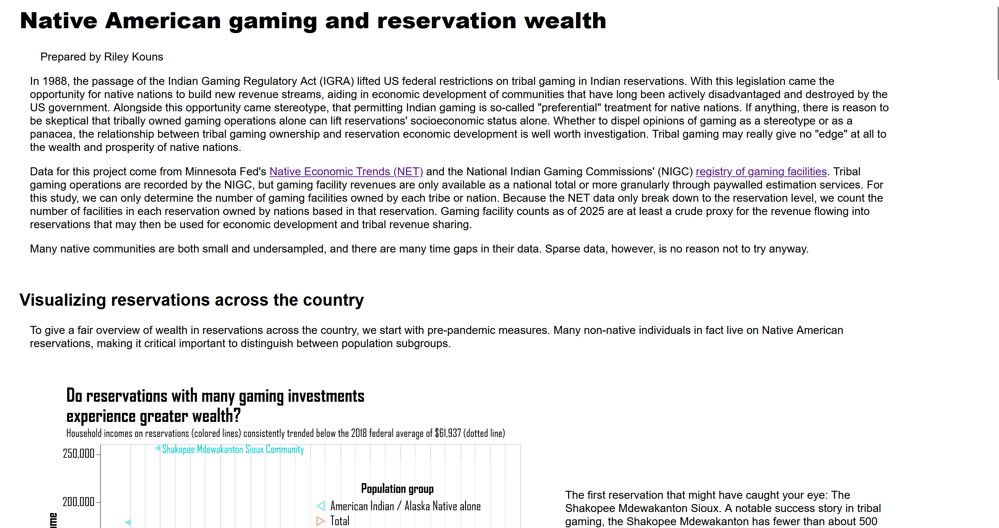

# Static Visualization Project - Native American Socioeconomic Outcomes and Gaming

Riley Kouns

## Description

Native nations in the US have faced unique historical and contemporary challenges, the effects of which can be seen in part in many reservations' economic struggles today. US federal legislation in the 1990s began a new chapter for tribal revenue streams, specifically casinos. However, preconceptions abound surrounding tribal gaming. By following Census economic measures on reservations since the 1990s, this project paints a slightly more detailed view of native nations' economic development through gaming.

<kbd>
    
</kbd>

## Data Sources

Data for this project came from Minnesota Fed's [Native Economic Trends](https://www.minneapolisfed.org/indiancountry/resources/native-economic-trends) and the National Indian Gaming Commissions' [registry of gaming tribes](https://www.nigc.gov/map).

 

“Native Economic Trends: Federal Reserve Bank of Minneapolis.” Federal Reserve Bank of Minneapolis: Pursuing an Economy that works for all of us. Accessed October 15, 2025. https://www.minneapolisfed.org/indiancountry/resources/native-economic-trends

“Map of Indian Gaming Locations: Gaming Tribes by State (Pdf).” National Indian Gaming Commission, June 17, 2025.
    https://www.nigc.gov/map/.